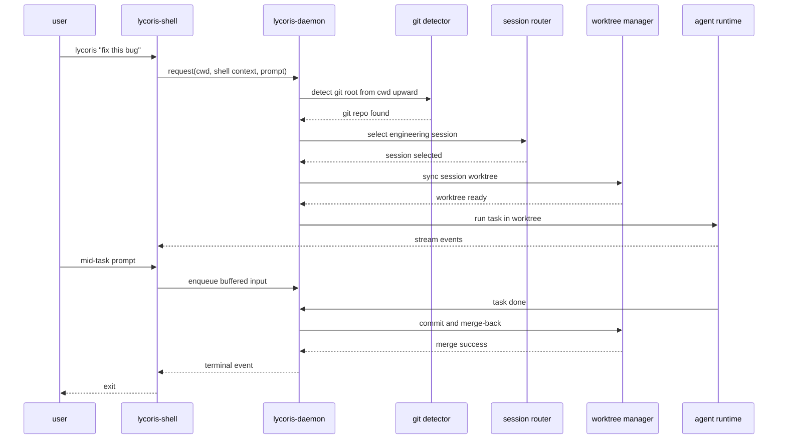
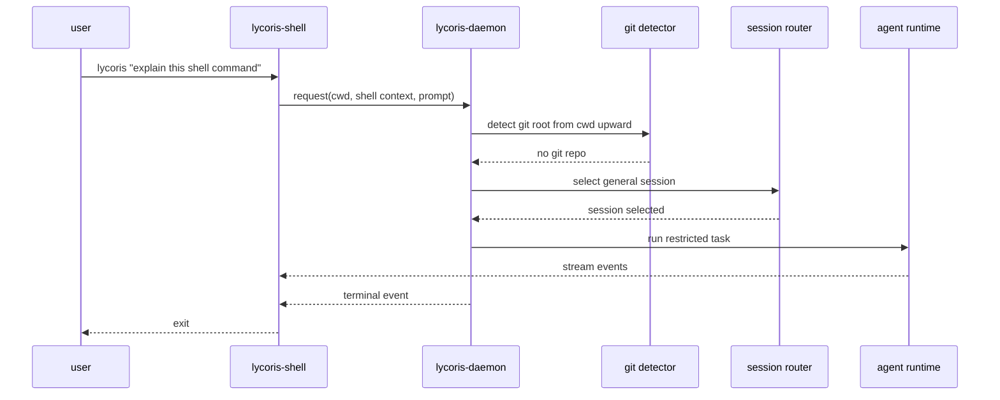

# Lycoris 架构总览、开发计划与评测方案

更新日期：2026-04-30
状态：架构草案 v1

## 1. 文档拆分

本组文档现在拆成四层：

- 总览与阶段计划：本文 [lycoris-architecture-plan.md](lycoris-architecture-plan.md)
- 协议、数据模型与存储：见 [lycoris-protocol-and-storage.md](lycoris-protocol-and-storage.md)
- shell 集成、git 检测、worktree 与 merge 生命周期：见 [lycoris-shell-worktree-lifecycle.md](lycoris-shell-worktree-lifecycle.md)
- 长期记忆与技能树：见 [lycoris-memory-and-skill-tree.md](lycoris-memory-and-skill-tree.md)

本文只保留：

- 产品契约
- 外部使用架构总览
- 阶段开发计划
- 评测总览

## 2. 一句话定义

Lycoris 是一个中心化 daemon 驱动的 AI agent 系统：

- `lycoris-daemon` 持续监听 API 端口并托管所有 session；
- `lycoris-shell` 与系统 shell 持续集成，用当前 shell 环境触发一次性 task；
- Lycoris 只提供两类 session：
  - `engineering session`
  - `general session`
- `engineering session` 面向 git 工程任务，拥有完整能力集，支持 run 内有界 sub-agent，并强制通过独立 worktree 工作与 merge-back 收口；
- `general session` 面向非工程任务，是 engineering session 的受限子集；
- Lycoris 维护两类长期记忆：面向 actor 的通用长期记忆，以及面向 project root 的项目路径长期记忆；
- Lycoris 维护 skill tree，用长期记忆和历史操作频率发现可沉淀的技能，并在用户审核后写入 skill；
- 命令行调用遵循 Unix 哲学：一次调用只完成一件 task，task 结束后前端立即退出，长期状态靠磁盘持久化的 session 维持。

## 3. 不可变产品约束

以下约束应被视为 Lycoris v1 的产品契约，而不是实现建议：

1. `lycoris-daemon` 必须长期运行，并持续监听外部 API 请求。
2. `lycoris-shell` 必须与系统 shell 持续集成，能够可靠采集当前 shell 进程特征。
3. 用户调用 Lycoris 时，必须先从当前目录向上寻找 git 仓库：
   - 找到 git 仓库：进入 engineering session 路径。
   - 未找到 git 仓库：进入 general session 路径。
4. 只有 engineering session 拥有写权限。
5. 两类 session 都可以对当前目录下文件进行只读访问；超出默认范围的文件访问必须授权。
6. engineering session 必须使用专属 worktree 工作，并且每次 task 完成时必须提交并 merge 回主线。
7. 同一 engineering session 的下一次 task 开始前，必须先同步其 worktree，再继续工作。
8. CLI 调用完成 task 后必须立即退出，但必须保留用户输入缓冲区以支持任务中途提示。
9. Web 和 Messenger 前端必须提供非 AI 命令用于 `new/select/list/switch/attach`。
10. 所有 session 都必须支持历史记录查询与 attach。
11. engineering session 需要尽可能特性完备，支持 sandbox、toolcalls、skills、workflow、sub-agents 等复杂编码能力。
12. general session 是 engineering session 的严格子集，只允许更少能力，不允许更多能力。
13. sub-agent 只能作为 engineering run 内的有界子执行单元，不能成为第三类 session、常驻 worker 或默认自治 agent team。
14. 通用长期记忆只能保存跨对话、跨项目长期有效的用户偏好、约束和重复模式，不能吸收大量临时对话信息。
15. 项目路径长期记忆只能保存 project root 下长期有效的上下文、约定和工作流，不能吸收太具体的某次工程实现。
16. skill tree 只能提出 skill candidate；真正写入 skill 必须经过用户审核。

## 4. 外部使用架构

### 4.1 daemon

`lycoris-daemon` 是全系统唯一控制面，负责：

- 监听 HTTP / WebSocket API 端口；
- 管理 session 生命周期；
- 管理 run / task 生命周期；
- 管理权限审批、历史回放、attach、输入缓冲；
- 管理 engineering run 内 sub-agent 的创建、收口、审计与资源边界；
- 管理长期记忆的候选提取、检索、审核和写入；
- 管理 skill tree 的频率统计、候选建议、用户审核和 skill 安装；
- 管理 engineering session 的 repo、worktree、merge-back；
- 将所有关键状态持久化到磁盘。

daemon 空闲时不应持续运行任何 AI 推理循环。它是任务控制器，不是常驻自驱 agent。

### 4.2 shell 集成

`lycoris-shell` 不是一个独立于 shell 的重会话环境，而是系统 shell 的增强入口。它应通过 shell integration 获取以下信号：

- `cwd`
- shell executable
- shell `pid`
- shell `ppid`
- process group / session id
- `tty`
- host
- SSH / remote 标记
- 用户身份

推荐把 shell 集成做成 shell function 或轻量 wrapper，而不是要求用户进入一个新的专有交互界面。

### 4.3 调用时的第一步：判定 session 类型

Lycoris 在每次调用时，必须先执行以下流程：

1. 从当前目录开始向上查找 git 根目录。
2. 如果当前目录或任一父目录是 git 仓库，则本次调用进入 `engineering session` 路径。
3. 如果找不到 git 仓库，则本次调用进入 `general session` 路径。

这个判定必须先于 session 选择发生。也就是说：

- 不是先找 session，再猜是不是工程任务。
- 而是先判定本次调用属于工程路径还是通用路径，再在对应类型里选 session。

### 4.4 session 选择规则

#### 4.4.1 engineering session

当当前目录位于 git 仓库内时：

- `session.root` 必须等于 git 仓库根目录。
- session 选择基于以下特征综合判定：
  - actor
  - repo root
  - shell lineage
  - 当前子路径 / path cluster
  - 最近 task 历史
  - 工作意图
- 同一 repo 下允许存在多个 engineering session。
- 因此 git repo 只定义“工程边界”，并默认映射到项目路径长期记忆边界，不是唯一 session key。

目标行为是：

- 同一 shell、同一路径簇、同一工作线程的多次调用，尽量归并到同一 engineering session。
- 同一 repo 下不同路径簇或不同工作线程，可以并行创建不同 engineering session。

#### 4.4.2 general session

当当前目录不在 git 仓库内时：

- 不创建工程 session。
- 选择或新建 `general session`。
- general session 只依赖 shell / actor 上下文，而不依赖 repo root。
- general session 的归并优先考虑：
  - actor
  - host
  - `tty`
  - shell lineage
  - 最近对话历史

目标行为是：

- 同一个 shell 工作线程上的轻量问答和 shell 任务，可以持续复用同一个 general session。
- 不同 shell 实例可以拥有不同 general session。

## 5. 两类 session 的能力边界

### 5.1 engineering session

engineering session 是 Lycoris 的完整能力形态，面向大型复杂编码任务。

默认能力：

- 读当前目录下文件
- 读当前 git 仓库内容
- 读 session 历史
- 使用完整工具集
- 使用 sandbox
- 使用 typed toolcalls
- 使用 skills
- 使用 workflows
- 使用受控 sub-agents
- 在 session 专属 worktree 中写入和执行
- 运行构建、测试、分析命令
- 生成 patch、commit、merge-back

默认限制：

- 写权限只作用于 session worktree，不作用于用户原始 checkout。
- sub-agent 只作用于父 run 分配的 scope，不能绕过 worktree、审批、权限或 merge-back 策略。
- 访问超出默认范围的文件系统路径必须授权。
- 访问高风险工具仍需通过审批策略。

### 5.2 general session

general session 是 engineering session 的受限子集，面向：

- 轻量问答
- 无 repo 的 shell 辅助任务
- 路径不稳定或不需要 repo 语义的临时工作

默认能力：

- 读当前目录下文件
- 读当前 shell 上下文
- 读 session 历史
- 使用限制版工具集
- 执行低风险 shell / 检索 / 分析任务

默认限制：

- 不允许写文件
- 不允许创建 worktree
- 不允许 merge-back
- 不允许使用超出策略的高风险工具
- 不允许具备比 engineering session 更多的权限

### 5.3 文件访问规则

这是 Lycoris 的基础权限规则：

- engineering session 与 general session 都可以读取当前目录下文件。
- 超出当前目录默认范围的文件读取必须授权。
- 只有 engineering session 具备写能力。
- engineering session 的写能力默认只发生在 session worktree 中。
- 用户原始工作目录和原始 repo checkout 默认都视为只读参考面。

### 5.4 sub-agent 边界

engineering session 必须支持 sub-agent，因为真实工程任务经常需要并行的代码探索、分片修改、测试验证和审阅复核。

但 sub-agent 不是 Lycoris 的新产品形态。它的边界必须非常硬：

- sub-agent 只能由一个 active engineering run 创建。
- sub-agent 共享父 session 的 `session_id`，拥有自己的 `child_run_id` 与 `parent_run_id`。
- sub-agent 不拥有独立 session、独立长期记忆根、独立 worktree 收口权或独立用户入口。
- sub-agent 不能由 heartbeat、cron、webhook 或后台队列主动唤醒。
- sub-agent 不能直接 commit 或 merge-back；最终提交和 merge-back 只能由父 run 收口。
- sub-agent 的所有 message、toolcall、artifact、approval 都必须进入父 session 的持久化事件流。
- sub-agent 必须有明确 scope、预算和终止条件；父 run 进入终态前，所有 sub-agent 必须已经完成、失败或取消。

这让 engineering session 能获得必要的工程并行能力，同时不把 Lycoris 变成默认常驻的 multi-agent society。

### 5.5 长期记忆边界

Lycoris 的长期记忆分两层：

- 通用长期记忆：绑定 actor，服务于临时对话、general session 和跨项目偏好。
- 项目路径长期记忆：绑定 canonical project root，服务于某个项目的长期上下文。

通用长期记忆应该保存：

- 用户长期偏好；
- 跨项目通用约束；
- 重复出现的通用任务模式；
- 用户明确要求长期保留的信息。

通用长期记忆不应该保存：

- 大量临时对话内容；
- 一次性问答细节；
- 没有跨场景价值的临时路径、日志或命令输出。

项目路径长期记忆应该保存：

- 项目结构、模块职责和稳定架构约束；
- 项目常用构建、测试、格式化和发布命令；
- 项目长期有效的编码约定和审核要求；
- 项目内反复出现的工作流。

项目路径长期记忆不应该保存：

- 某次工程实现的具体 patch；
- 只对某个短期分支成立的临时取舍；
- 大段 diff、日志、测试输出；
- 已经过期或无法泛化的局部实现细节。

长期记忆不是 transcript 的压缩包。它应该是稳定上下文索引，让后续 session 能更快理解用户和项目。

### 5.6 技能树边界

skill tree 用来发现“值得沉淀为 skill 的重复操作”，而不是自动生成隐藏能力。

skill tree 的输入包括：

- 长期记忆中的重复偏好和工作流；
- 多次 run 中相似的工具调用序列；
- 同一项目内反复出现的验证、构建、排错或发布步骤；
- 用户明确表达的可复用操作规则。

skill tree 的输出只能是 skill candidate。每个 candidate 必须说明：

- 适用范围是 global 还是 project；
- 触发条件是什么；
- 建议封装哪些步骤；
- 为什么频率和价值足以沉淀为 skill；
- 安全边界和验证方式是什么。

用户审核通过后，Lycoris 才能把 candidate 写入 skill。拒绝或未审核的 candidate 只能留在候选区，不能被 runtime 当作已安装 skill 使用。

## 6. engineering session 的 worktree 模型

### 6.1 基本原则

同一个 git 仓库可以拥有多个 engineering session，但每个 engineering session 必须有自己独立的 worktree。

也就是说：

- repo 是主线代码边界，并默认对应一个项目路径长期记忆边界；
- session 是单个工作线程；
- worktree 是单个 session 的执行隔离面。

### 6.2 task 生命周期

engineering session 的每次 task 必须遵循以下硬约束：

1. 解析当前目录对应的 git 仓库根。
2. 选中或创建 engineering session。
3. 找到该 session 的 dedicated worktree。
4. 在 task 开始前先同步 worktree。
5. 在 worktree 中执行本次 task。
6. task 完成后，必须提交本次变更。
7. 提交后，必须 merge 回主线。
8. 只有在 merge-back 成功后，task 才能进入真正的完成态。

这意味着“完成 task 但不提交、不合并”不是允许状态。

### 6.3 下一次 task 的开始条件

当用户在同一 engineering session 中再次发起 task 时：

- 不能直接在旧 worktree 上继续跑。
- 必须先从仓库主线同步该 session 的 worktree。
- 同步完成后，才开始下一次 task。

这样可以保证：

- session 连续性存在；
- worktree 不长期漂移；
- 每次 task 都以可预期的 repo 状态开始。

### 6.4 merge 失败与冲突

如果 merge-back 失败：

- task 不能被标记为正常完成；
- session 应进入显式阻塞态，例如 `needs_resolution`；
- 用户可以 attach 查看状态并介入；
- 下一次 task 默认不能跳过未收口的 merge 冲突。

## 7. 长任务与 Unix 哲学

Lycoris 的 CLI 行为必须符合 Unix 哲学：

- 一次调用只做一件 task；
- task 进入终态后，前端立刻退出；
- 长期状态不靠前端驻留，而靠磁盘持久化的 session；
- shell crash 不应中断 daemon 持有的 run。

但为了支持真实 agent 工作流，Lycoris 还必须具备输入缓冲区：

- 用户在 task 运行中可以继续发消息；
- 这些输入必须 durable；
- 输入可以排队，也可以作为中途提示；
- 前端重连后必须能看到仍未消费的输入和已消费记录。

sub-agent 支持不能改变这条 Unix 边界：

- 用户的一次 CLI 调用仍然只提交一个 task。
- shell 前端仍然只 attach 到一个用户可见 parent run。
- sub-agent 事件只能作为 parent run 的嵌套事件展示和持久化。
- parent run 终态前必须收口全部 sub-agent。
- daemon 空闲时 AI worker 数量仍然必须为 0。

## 8. Web 与 Messenger 的外部控制面

Web 与 Messenger 不应只提供“自然语言入口”，还必须提供非 AI 命令能力。

至少要支持：

- `session new`
- `session list`
- `session select`
- `session switch`
- `session attach`
- `session history`

原因很简单：

- Web / Messenger 没有系统 shell 上下文，不适合完全依赖自动推断；
- 用户必须能显式地管理 session；
- 这也是 attach、历史查询、长期任务恢复的基础。

## 9. 历史查询与 attach

所有 session 都必须支持：

- 历史消息查询
- task 历史查询
- 工具调用历史查询
- 审批历史查询
- attach 到当前运行 task
- attach 到已完成 task 做回放

attach 的本质不是“进入一个 UI”，而是：

1. 回放历史事件；
2. 再接上 live stream。

这对两类 session 都必须成立。

## 10. 总览时序

### 10.1 engineering session 路径

### 10.2 general session 路径

## 11. 内部设计拆分说明

下列细节已经拆到专项文档：

- control API、session / run / approval / buffered input 模型：
  见 [lycoris-protocol-and-storage.md](lycoris-protocol-and-storage.md)
- 磁盘布局、事件流、attach、权限能力矩阵：
  见 [lycoris-protocol-and-storage.md](lycoris-protocol-and-storage.md)
- shell integration、git 检测、worktree 生命周期、merge-back：
  见 [lycoris-shell-worktree-lifecycle.md](lycoris-shell-worktree-lifecycle.md)
- 长期记忆分层、skill tree、skill candidate 审核：
  见 [lycoris-memory-and-skill-tree.md](lycoris-memory-and-skill-tree.md)

这里仅保留实现约束：

- daemon 层面允许多个 session 并发运行；
- 单个 session 内默认只允许一个用户可见 active parent run；
- engineering parent run 可以拥有有界 child runs / sub-agents，但它们不能接收独立用户 prompt，不能与 parent run 竞争 session 控制权；
- engineering session 与 general session 都遵守“单 session 串行”；
- 同一 repo 下多个 engineering session 可以并行，只要 worktree 隔离；
- general session 永远不能获得比 engineering session 更多的权限。

## 12. 开发计划

### 12.1 Phase 0：定稿外部契约

目标：

- 固化两类 session 的产品定义；
- 固化 git 检测与 session 路由规则；
- 固化 worktree / merge-back 强约束；
- 固化 shell integration contract。

验收：

- 文档中不再存在“第三类 session”或模糊模式；
- 所有前端都基于同一 session 抽象。

### 12.2 Phase 1：daemon 与持久化骨架

目标：

- 启动 `lycoris-daemon`；
- 开放基础 API；
- 建立 session / run / history / attach 持久化；
- 建立通用长期记忆、项目路径长期记忆和 skill candidate 的存储骨架；
- 建立 general session 的完整数据路径。

验收：

- daemon 可长期运行；
- 可创建 general session；
- 可查询历史；
- 可 attach 回放。
- 可持久化 memory candidate 和 skill candidate，但不自动写入长期记忆或安装 skill。

### 12.3 Phase 2：shell integration 与 session 路由

目标：

- 实现 shell integration；
- 收集 shell 进程特征；
- 实现 git 检测；
- 实现 engineering / general 两路分流；
- 实现 session 自动选择。

验收：

- 在 git repo 内调用时稳定进入 engineering 路径；
- 在非 git 目录调用时稳定进入 general 路径；
- 同一 shell 工作线程能稳定复用 session。

### 12.4 Phase 3：engineering session 的 repo / worktree 能力

目标：

- 建立 repo registry；
- 为 engineering session 自动创建 dedicated worktree；
- 每次 task 前同步 worktree；
- 让 runtime 在 worktree 中执行。

验收：

- 同一 repo 可有多个 engineering session；
- 多 session 的 worktree 互不污染；
- engineering session 不在原始 checkout 上写入。

### 12.5 Phase 4：merge-back 强约束

目标：

- 每次 engineering task 完成后自动 commit；
- 自动 merge 回主线；
- merge 失败进入阻塞态；
- 允许 attach 和人工介入。

验收：

- engineering task 未 merge 成功前不能算真正完成；
- 下一次 task 不会绕过未解决的冲突状态。

### 12.6 Phase 5：能力分层与复杂编码能力

目标：

- engineering session 支持 sandbox、toolcalls、skills、workflow、sub-agents；
- sub-agent 作为 engineering run 内 child-run 模型落地；
- general session 保持为严格受限子集；
- 打通审批与工具权限策略。

验收：

- engineering session 能处理大型复杂编码任务；
- sub-agent 不会创建独立 session，不会越过父 run 权限边界，不会在 parent run 终态后继续运行；
- general session 不会越权获得写能力或高级编排能力。

### 12.7 Phase 6：长期记忆与技能树

目标：

- 实现通用长期记忆和项目路径长期记忆；
- 实现 run 结束后的 memory candidate 提取；
- 实现 skill tree 的频率统计和 skill candidate 生成；
- 实现用户审核后写入 memory / skill 的流程。

验收：

- 通用长期记忆不会吸收大量临时对话信息；
- 项目路径长期记忆不会吸收过细的单次工程实现；
- 同一项目路径下的 engineering session 能检索项目记忆；
- skill candidate 只在用户审核后变成 installed skill。

### 12.8 Phase 7：Web / Messenger 控制面

目标：

- 提供 `new/select/list/switch/attach/history` 非 AI 命令；
- 允许 Web / Messenger 管理 session；
- 允许从这些前端 attach 到正在运行的 task。

验收：

- 不依赖自然语言也能显式管理 session；
- Web / Messenger 与 shell 对同一 session 的观察一致。

## 13. 评测方案

### 13.1 功能正确性

必须覆盖以下测试集：

- `git-detection`
  - 从当前目录向上查找 git repo 是否正确
- `session-routing`
  - engineering / general 分流是否正确
- `session-selection`
  - 同一工作线程是否能正确复用 session
- `history-attach`
  - 所有 session 的历史查询和 attach 是否正确
- `buffered-input`
  - 用户中途提示是否能被 durable 地排队和消费
- `long-term-memory`
  - 通用长期记忆和项目路径长期记忆是否正确分层
  - 临时对话信息是否不会大量污染通用长期记忆
  - 单次工程实现细节是否不会污染项目路径长期记忆
- `skill-tree`
  - 重复操作是否能生成 skill candidate
  - 未经用户审核的 candidate 是否不会变成 installed skill

### 13.2 engineering 专项

- `worktree-isolation`
  - 同 repo 多 engineering session 的 worktree 隔离
- `worktree-sync`
  - 同一 session 的下一次 task 前是否先同步 worktree
- `merge-back`
  - 每次 task 是否强制 commit + merge
- `conflict-state`
  - merge 失败时是否进入阻塞态
- `large-coding-task`
  - engineering session 是否能完成复杂编码任务
- `subagent-boundary`
  - sub-agent 是否只存在于 engineering parent run 内
  - child run 是否正确继承 session、worktree、审批和审计边界
  - parent run 终态前是否收口所有 sub-agent

### 13.3 general 专项

- `general-session-restriction`
  - general session 是否被正确限制为子集
- `no-write-safety`
  - general session 是否完全没有写权限
- `shell-only-history`
  - general session 是否能维持 shell 级会话历史

### 13.4 指标

| 指标                            | 含义                                  | 建议门槛               |
| ------------------------------- | ------------------------------------- | ---------------------- |
| git detection accuracy          | 工程/通用路径判定准确率               | 100% on curated corpus |
| session routing accuracy        | engineering/general 分流准确率        | >99%                   |
| session reuse accuracy          | 同一工作线程复用准确率                | >95%                   |
| worktree isolation correctness  | 多 engineering session 隔离正确率     | 100%                   |
| merge-back success rate         | 正常 engineering task 的 merge 成功率 | 尽量接近 100%          |
| blocked-on-conflict correctness | merge 失败时正确进入阻塞态            | 100%                   |
| general no-write safety         | general session 无写权限正确率        | 100%                   |
| attach recovery success         | 断连后 attach 恢复成功率              | 100%                   |
| buffered input durability       | 中途输入不丢失                        | 100%                   |
| subagent boundary correctness   | sub-agent 不越过 parent run 边界      | 100%                   |
| memory admission precision      | 长期记忆写入是否足够克制              | >95%                   |
| skill approval correctness      | skill 是否只在用户审核后安装          | 100%                   |
| idle AI worker count            | daemon 空闲时 AI worker 数量          | 0                      |

## 14. 最终结论

Lycoris 的外部使用架构应明确为：

- daemon 常驻监听；
- shell 与系统 shell 集成；
- 在 git repo 内统一走 engineering session；
- 在非 git 目录统一走 general session；
- engineering session 具备完整能力、run 内有界 sub-agent、独立 worktree、强制 commit + merge-back；
- general session 是 engineering session 的受限子集；
- 长期记忆分为 actor 级通用记忆和 project root 级项目路径记忆，并且都必须避免污染；
- skill tree 只负责发现和建议高频操作，用户审核后才写入 skill；
- CLI 一次只做一个 task，完成即退出；
- 长期状态靠磁盘 session、历史查询、attach、输入缓冲来维持；
- Web / Messenger 必须提供显式 session 管理命令，而不是只依赖自然语言。

如果后续实现偏离这组约束，就会偏离 Lycoris 的产品定义本身。
