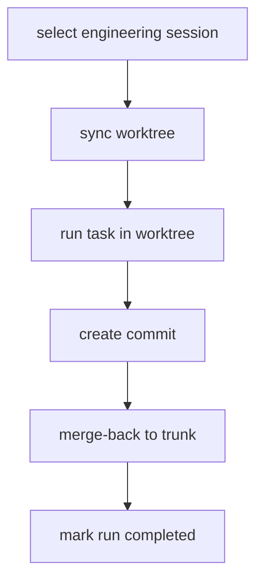
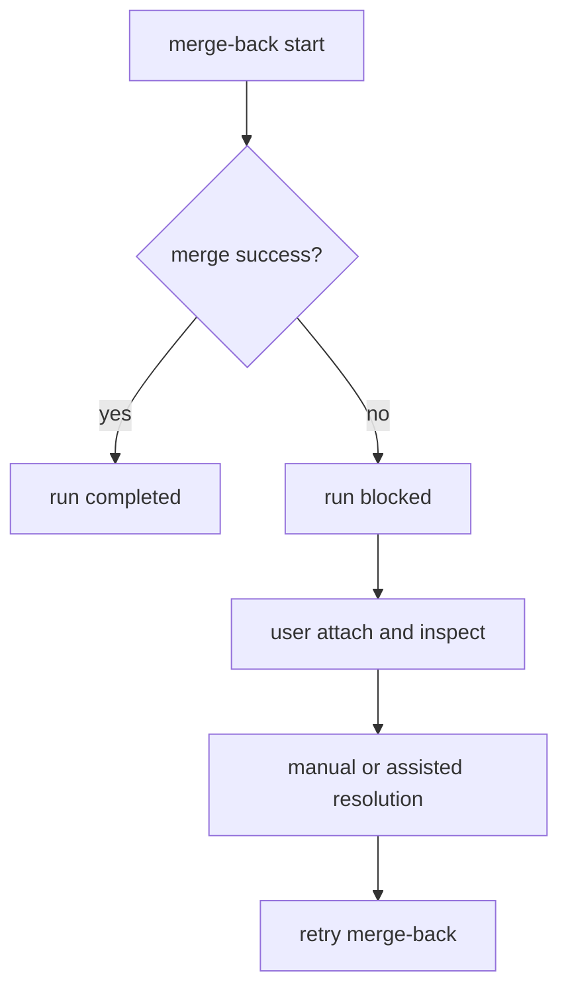

# Lycoris Shell 集成与 Worktree 生命周期

更新日期：2026-04-30
状态：设计草案 v1

## 1. 文档范围

本文只回答以下问题：

- `lycoris-shell` 如何与系统 shell 集成；
- daemon 如何从一次调用路由到 engineering 或 general session；
- engineering session 的 worktree 生命周期如何运转；
- engineering run 内 sub-agent 如何在不破坏 Unix 调用模型的前提下运行；
- 长期记忆和 skill tree 如何参与 run 开始与收口；
- merge-back 失败时系统如何阻塞和恢复；
- Web / Messenger 如何在没有 shell 上下文时管理 session。

协议和存储细节，见 [lycoris-protocol-and-storage.md](lycoris-protocol-and-storage.md)。

## 2. Shell 集成契约

### 2.1 Lycoris shell 的定位

`lycoris-shell` 不是长期驻留的私有 TUI，而是系统 shell 的增强调用入口。

它的职责很克制：

- 读取当前 shell 上下文；
- 把上下文发给 daemon；
- attach 到当前 run；
- 显示 stream、approval、question；
- run 进入终态后立即退出。

### 2.2 必须上传的 shell context

- `cwd`
- shell executable
- `pid`
- `ppid`
- process group
- session id
- `tty`
- host
- SSH / remote 标记
- actor / uid

这些信号用于：

- engineering / general 路由；
- session 自动选择；
- shell-thread 级历史归并；
- 通用长期记忆和项目路径长期记忆检索；
- crash 后 attach 恢复。

### 2.3 推荐集成方式

推荐优先级：

1. shell function
2. wrapper command
3. 独立可执行文件

不推荐让用户先进入一个常驻专有界面，再在里面工作。

## 3. 路由生命周期

### 3.1 总路由规则

每次调用 Lycoris 时，daemon 必须执行固定顺序：

1. 从 `cwd` 向上查找 git 仓库。
2. 找到 git 仓库：
   - 进入 engineering 路径。
3. 找不到 git 仓库：
   - 进入 general 路径。
4. 在该路径内选择或创建 session。
5. 选择通用长期记忆和项目路径长期记忆的检索范围。
6. 创建 run。
7. attach 并开始流式工作。

### 3.2 为什么必须先路由再选 session

因为这决定了：

- 是否允许写入；
- 是否需要 worktree；
- 是否需要 repo memory；
- 是否需要 merge-back。

所以“先找 session 再决定会话类型”会把权限和生命周期搞乱。

## 4. engineering session 获取流程

### 4.1 进入条件

必须满足：

- 当前目录或父目录能找到 git 仓库；
- 当前调用被识别为工程路径。

### 4.2 选择规则

选择 engineering session 时，daemon 需要综合以下信号：

- actor
- repo root
- shell lineage
- 当前 path cluster
- 最近 task 历史
- 工作意图

目标不是“一个 repo 只有一个 session”，而是：

- 同一工作线程尽量稳定复用；
- 不同工作线程可以并行形成多个 engineering session。

### 4.3 选择结果

可能结果只有两种：

- 复用已有 engineering session；
- 创建新 engineering session。

创建新 engineering session 时，必须同步创建：

- session 元数据；
- dedicated worktree；
- 该 session 的 worktree branch / integration branch 元数据。

## 5. general session 获取流程

### 5.1 进入条件

当 `cwd` 向上无法找到 git 仓库时，必须进入 general 路径。

### 5.2 选择规则

选择 general session 时，优先使用：

- actor
- host
- `tty`
- shell lineage
- 最近历史

general session 不需要：

- repo root
- worktree
- merge-back

### 5.3 general session 的用途

- 轻量问答
- shell 命令解释
- 无 repo 的临时分析
- 受限 shell 工作

它不是“低配工程模式”，而是工程模式的严格受限子集。

## 6. engineering session 的 Worktree 生命周期

### 6.1 Worktree 的角色

在 engineering 路径里：

- repo root 是工程边界；
- session 是工作线程；
- worktree 是写入与执行隔离面。

因此：

- 用户原始 checkout 默认不写；
- session 的所有改动都发生在 dedicated worktree。

### 6.2 创建阶段

当新 engineering session 建立时：

1. 解析 repo root。
2. 在 daemon 存储中注册或查找 repo 对象。
3. 为该 session 分配 `worktree_id`。
4. 在 `worktrees/<repo-id>/<session-id>/` 下创建实际 worktree。
5. 写入 `worktree.json` 元数据。

### 6.3 每次 task 的开始阶段

每次 engineering task 开始前，必须先做：

1. 校验 worktree 是否存在；
2. 从主线同步 worktree；
3. 修复或重建损坏的 worktree 元数据；
4. 只有在 worktree ready 后，才允许 runtime 开始工作。

### 6.4 执行阶段

runtime 在 engineering 路径里默认工作目录必须是 session worktree，而不是用户原始 `cwd`。

这意味着：

- 文件读写默认作用于 worktree；
- 构建、测试、lint 默认在 worktree 中执行；
- patch、diff、commit 都来自 worktree。

### 6.5 sub-agent 执行边界

engineering run 可以创建 sub-agent 来并行完成代码探索、局部实现、验证或审阅任务，但 sub-agent 必须被视为 parent run 的内部执行单元。

硬约束：

- sub-agent 只能在 engineering session 中创建。
- sub-agent 继承 parent run 的 session、worktree、权限策略和审批策略。
- sub-agent 默认只读；需要写入时必须有明确 path scope、文件锁或父 runtime 分配的隔离 scratch 区。
- sub-agent 不能直接提交、merge-back 或把 run 标成完成。
- sub-agent 的所有事件都必须写入 parent session 的事件流。
- parent run 进入终态前，所有 sub-agent 必须已经完成、失败或被取消。

这保证工程任务可以并行分解，但用户仍然只面对一个 task、一个 parent run、一个最终收口点。

## 7. engineering task 的强制收口

### 7.1 完成的定义

engineering task 只有在以下条件同时满足时才算完成：

1. agent 工作结束；
2. 变更已提交；
3. 提交已 merge 回主线。

缺任一项都不算完成。

### 7.2 正常路径

### 7.3 冲突路径

### 7.4 被阻塞后的规则

如果 merge-back 失败：

- run 进入 `blocked` 或 `needs_resolution`；
- session 进入阻塞态；
- 默认不允许直接开始下一次 engineering task；
- 用户必须先 attach 并解决收口问题。

## 8. CLI 调用与输入缓冲

### 8.1 Unix 风格调用

Lycoris CLI 必须像一个一次性命令：

- 用户发起一次 task；
- shell 挂接当前 run；
- run 到终态后 shell 立即退出。

不允许把“前端不退出”当成长期任务支持的基础。

即使 parent run 内部使用 sub-agent，这条规则也不变：

- shell 不需要进入 sub-agent 专用 UI；
- shell 只展示 parent run 的流式事件和嵌套 child run 摘要；
- sub-agent 并行度不能让 CLI 变成长驻调度器；
- daemon 空闲时不能保留等待自驱的 sub-agent。

### 8.2 为什么仍然需要输入缓冲

因为复杂任务运行期间，用户仍然需要：

- 补充约束；
- 中途纠偏；
- 回答问题；
- 提供新的局部指令。

所以：

- shell 必须能接受中途输入；
- 输入必须 durable；
- 输入既可以排队，也可以在安全点插入。

### 8.3 crash 恢复

shell crash 不应影响 daemon 持有的 run。

恢复流程：

1. 用户重新调用 `attach`。
2. daemon 回放该 session / run 的历史。
3. 再继续 live tail。

## 9. attach 生命周期

### 9.1 attach 到运行中 task

用于：

- 继续看输出；
- 处理中途审批；
- 处理中途问题；
- 提交 buffered input。

如果 run 内存在 sub-agent，attach 应先回放 parent run 事件，再按事件顺序展示 child run 的开始、输出摘要、artifact、失败或完成状态。

### 9.2 attach 到已完成 task

用于：

- 查询历史；
- 回放工具调用；
- 查看 merge 结果；
- 审计一次 task。

### 9.3 attach 与前端的关系

attach 目标是 session / run，不是某个具体 UI。

因此：

- shell 可以 attach；
- web 可以 attach；
- messenger 也可以 attach 到摘要化视图。

## 10. Web / Messenger 控制面

### 10.1 为什么必须有非 AI 命令

Web / Messenger 没有稳定的 shell 上下文，所以不能把 session 管理全部交给自然语言推断。

必须至少支持：

- `session new`
- `session list`
- `session select`
- `session switch`
- `session attach`
- `session history`

### 10.2 Web / Messenger 的典型行为

- 用户先列出 session；
- 再显式选择一个 session；
- 然后提交任务或 attach；
- 若需要跨 session 切换，则显式执行 switch。

这可以避免在无 shell 上下文时出现错误归并。

## 11. 长期记忆与技能树生命周期

### 11.1 run 开始前的记忆检索

daemon 在完成 session 路由后，应组装本次 run 的 memory context：

1. 根据 actor 读取通用长期记忆。
2. 根据 `cwd`、git root 或显式 project root 查找项目路径长期记忆。
3. 按当前 prompt、path cluster、工具类型和最近任务筛选相关条目。
4. 在预算内注入运行时上下文。

约束：

- 不把整份长期记忆直接塞进 prompt。
- general session 默认只加载通用长期记忆。
- engineering session 默认加载通用长期记忆和项目路径长期记忆。
- 项目路径记忆优先于通用记忆中的冲突条目。

### 11.2 run 收口后的记忆候选

run 进入终态后，daemon 可以生成 memory candidate。

候选必须先分类：

- 跨项目成立：进入通用长期记忆候选。
- 只对当前 project root 成立：进入项目路径长期记忆候选。
- 只对某次运行成立：保留在 history，不进入长期记忆候选。

过滤规则：

- 通用长期记忆候选不能包含大量临时对话信息。
- 项目路径长期记忆候选不能包含过细的单次工程实现。
- 大段 diff、日志、测试输出只应作为 artifact 或 history 保存。

### 11.3 skill tree 更新

daemon 可以在 run 收口后更新 skill tree 的 observed pattern：

- 记录重复 prompt 意图；
- 记录重复工具调用序列；
- 记录项目内反复出现的验证流程；
- 记录用户明确要求复用的操作规则。

当频率和价值达到阈值时，daemon 只能创建 skill candidate，并通过事件或前端提示用户审核。

### 11.4 skill 审核与安装

skill candidate 被用户接受前，runtime 不能把它当作已安装 skill。

审核流程：

1. daemon 生成 candidate。
2. 前端展示触发条件、适用 scope、建议步骤和安全边界。
3. 用户接受、修改后接受、拒绝或禁止同类建议。
4. 只有接受后，daemon 才写入 global 或 project skill。
5. 写入后追加 `skill.installed` 事件。

Unix 边界仍然成立：skill 建议可以作为持久化事件留待之后处理，不要求 shell 为了等待审核长期驻留。

## 12. 生命周期测试重点

### 12.1 路由正确性

- 在 repo 内是否总是进入 engineering 路径；
- 在非 repo 目录是否总是进入 general 路径。

### 12.2 session 复用正确性

- 同一 shell 工作线程是否复用正确 session；
- 不同工作线程是否不会错误复用。

### 12.3 worktree 正确性

- 创建是否成功；
- 每次 task 前是否同步；
- 是否只在 worktree 中写入；
- 多 engineering session 是否互不污染。

### 12.4 sub-agent 正确性

- sub-agent 是否只能在 engineering parent run 内创建；
- sub-agent 是否继承 parent run 的 worktree 和权限边界；
- writable sub-agent 是否只能写入分配 scope；
- parent run 终态前是否收口所有 sub-agent。

### 12.5 merge-back 正确性

- 是否总是先 commit 再 merge；
- merge 冲突时是否阻塞；
- 阻塞后是否必须先解决冲突才能继续。

### 12.6 memory 与 skill tree

- 通用长期记忆是否不会被临时对话污染；
- 项目路径长期记忆是否不会被单次实现细节污染；
- run 收口后是否生成可审核 memory candidate；
- 重复操作是否生成 skill candidate；
- 未审核 skill candidate 是否不会被安装。

### 12.7 crash 与 attach

- shell crash 后 run 是否继续；
- attach 是否总能回放并接上 live stream；
- buffered input 是否不会丢失。

## 13. 与其他文档的关系

- 产品总览、开发计划、评测总览：见 [lycoris-architecture-plan.md](lycoris-architecture-plan.md)
- API、数据模型、权限策略、存储：见 [lycoris-protocol-and-storage.md](lycoris-protocol-and-storage.md)
- 长期记忆分层与技能树流程：见 [lycoris-memory-and-skill-tree.md](lycoris-memory-and-skill-tree.md)
